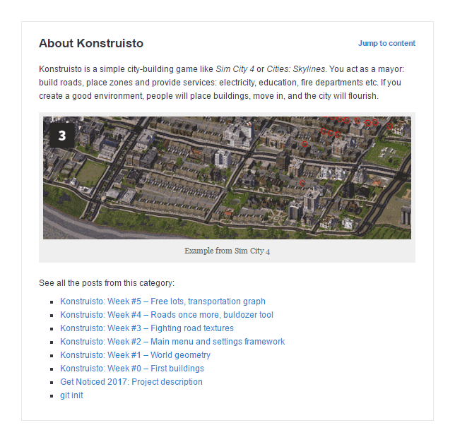

# Project Description Plugin

A simple plugin to show custom content before article main text, along with list of articles from the category. Includes full editor for the content.

  

## Features

* Set custom title and contents (full editor)
* Show in articles from single category
* Show in category archives (disabled by default), optionally in subcategories
* Toggle "Jump to content" link
* Toggle article list visibility

## Installation

1. Copy contents to your `wp-content/plugins` directory or upload ZIP with repo contents via Wordpress admin (Plugins/Add new/Upload plugin).
1. In admin site, do to *Settings/Project description*.
1. Fill in the *About the project* section.
1. Choose category from *General settings*.
1. Save changes.

## License

Copyright © 2017 Krzysztof Antoniak (http://antoniak.in/). Licensed under GNU General Public License, version 3.0 (GPL-3.0).